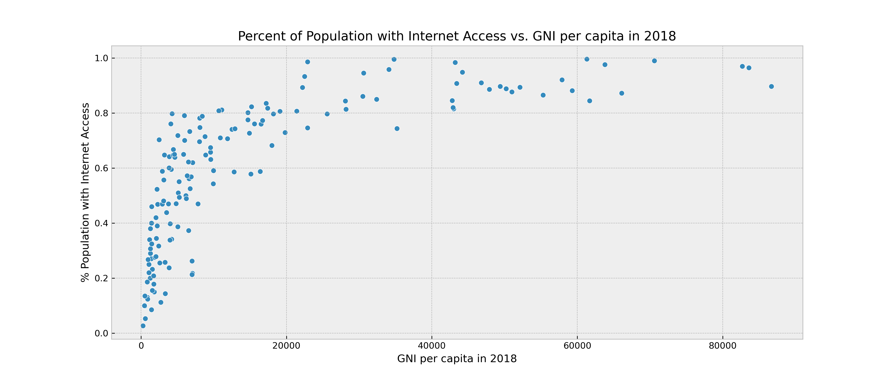
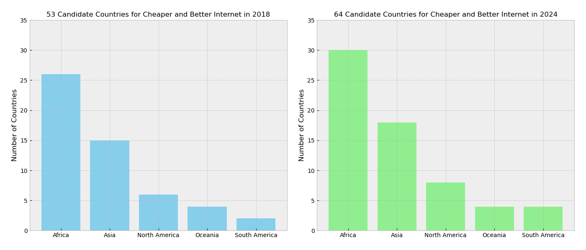
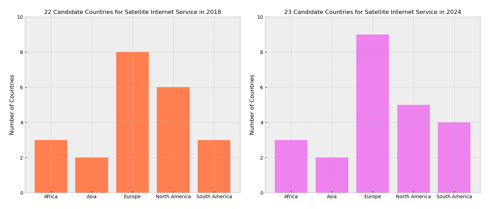
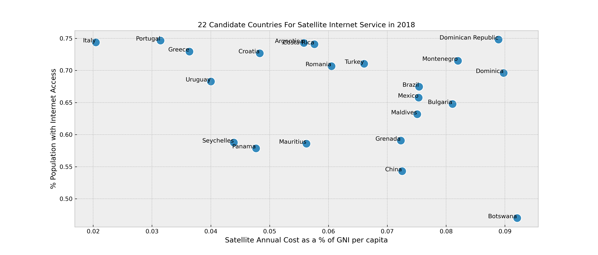
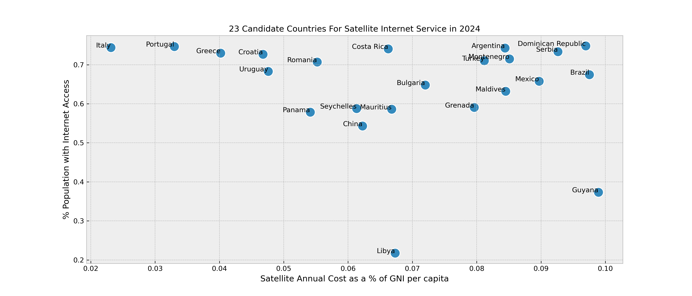

# Bridging Digital Divides: Satellite Internet Access EDA & Data Visualization Study

# Introduction

Internet access has become a cornerstone of development, enabling individuals and communities to participate in the global economy, access education, and engage with digital platforms. Despite this importance, the internet accessibility level globally varies significantly, with some regions enjoying near-universal access while others lag far behind. This disparity presents both a challenge and an opportunity for companies like Starlink, which aims to provide high-speed internet access globally, particularly in underserved areas.

Satellite internet service is redefining the reach and quality of global internet access. This technology beams internet connectivity directly from satellites in low earth orbit to users on the ground, making it an ideal solution for rural and remote areas where traditional broadband is unavailable or inefficient. Starlink, a venture by SpaceX founded in 2015, is rapidly deploying a vast network of low Earth orbit satellites and offering satellite internet services to customers, particularly in areas with poor or no existing internet service. Customers buy a starter kit, which comes with a satellite dish and router, and subscribe to a monthly plan for broadband internet access.

# Objective

The objective of this Exploratory Data Analysis (EDA) and Data Visualization project is to analyze internet accessibility, population size, and the Gross National Income (GNI) per capita of each country to identify underserved regions. These regions represent potential markets for Starlink to expand their satellite internet communication business in the next few years.

This project aims to answer the following questions:

##### 2018 Data Exploration:
1) Is there a between a country's GNI per capita and the percentage of the population with access to internet?
2) How many countries have less than 75% of their population with access to the internet?
3) How many countries have an average monthly internet cost exceeding 60 USD/month?
4) How many countries have an average annual internet cost that is higher than 10% of the GNI per capita?
5) In 2018, what are the top 5 countries where Starlink can expand their internet satellite business?

##### Projections for 2024:
Based on the 2024 population and GNI per capita data, the 2018 country internet access percentage of the population, and the 69 USD/month average cost of Starlink service:

6) How many countries have an average annual internet cost that is higher than 10% of the GNI per capita?
7) What are the top 5 countries where Starlink can expand its internet satellite business?
8) Is there a trend from 2018 to 2024?

# Assumptions

- The monthly cost of a Starlink satellite internet service for residential use is conservatively estimated to be 60 USD/month globally in 2018 and 69 USD/month in 2024. This does not include the fixed hardware cost. As of 2023, Starlink monthly suscription fees can vary from country to country between 25 USD to 100 USD and the hardward cost ranges between 200 USD to 650 USD for a Starlink terminal. [Unofficial crowsourced Starlink Pricing by Country]('https://docs.google.com/spreadsheets/d/1tuhyh6kbyDQ2D418ug_AgS1ZM_8MDDznrjWzDthU61w/edit#gid=1321340681')
- A country is considered lacking access to internet service if less than 75% of the population have access to the internet.
- A internet service annual cost that is 10% of the GNI per capita is considered sustainable for the end users.

# Tools
- Jupyter Lab
- Python
- Pandas
- Numpy
- Matplotlib
- Seaborn

# Data Dictionary

Datasets from Gapminder.org including population, GNI, adult literacy rate, and broadband subscribers per 100 people will serve as our primary data sources.
Data on the average monthly cost (USD) of internet access in a given country and the percentage of the population with access to the internet was obtained from a Research Note by the American Astronomical Society titled "Satellite Constellation Internet Affordability and Need" [Link to Research Note](https://iopscience.iop.org/article/10.3847/2515-5172/abc48e) and [Link to dataset](https://zenodo.org/records/4133884)

|Feature|Type|Dataset|Description|
|---|---|---|---|
|**country**|*string*|Gapminder|Name of the country or region.|
|**year**|*integer*|Gapminder|The year the data was recorded.|
|**monthly_internet_cost_2018**|*float*|AAS|The average monthly cost in USD of internet access in a given country in 2018.|
|**internet_percent_of_population**|*float*|AAS|The percentage of the population with internet access in 2018. An internet user is defined by the International Telecommunication Union as anyone who has accessed the internet from any location in the last three months. This can be from any type of device, including a computer, mobile phone, personal digital assistant, games machine, digital TV, and other technological devices.|
|**population_2018**|*float*|Gapminder|Using the UN POP data forecast models, this is the number of inhabitants living in a country in 2018.|
|**population_2024**|*float*|Gapminder|Using the UN POP data forecast models, this is the number of inhabitants living in a country in 2024.|
|**gni_2018**|*float*|Gapminder|Gross National Income (GNI) per capita in US dollars, adjusted for purchasing power parity (PPP), indicating the economic strength of the country or region in 2018.|
|**gni_2024**|*float*|Gapminder|Gross National Income (GNI) per capita in US dollars, adjusted for purchasing power parity (PPP), indicating the economic strength of the country or region in 2024.|
|**annual_internet_cost_2018**|*float*|Calculated|The annual cost of monthly internet fees in 2018 (monthly_internet_cost_2018 x 12).|
|**annual_internet_cost_2024**|*float*|Calculated|The annual cost of monthly internet fees in 2024, adjusted for inflation.|
|**annual_cost_percent_GNI_2018**|*float*|Calculated|The annual cost of internet access as a percent of GNI per capita in 2018, (annual_internet_cost_2018 / gni_2018)|
|**annual_cost_percent_GNI_2024**|*float*|Calculated|The annual cost of internet access as a percent of GNI per capita in 2024, (annual_internet_cost_2024 / gni_2024)|
|**sat_annual_cost_per_GNI_2018**|*float*|Calculated|The annual cost of satellite internet as a percent of GNI per capita in 2018, assuming a 60 USD/month cost for Starlink. ((60 x 12)/ gni_2018)|
|**sat_annual_cost_per_GNI_2024**|*float*|Calculated|The annual cost of satellite internet as a percent of GNI per capita in 2024, assuming a 60 USD/month monthly cost for Starlink. (69 x 12)/ gni_2024).|

# Executive Summary

Internet access is essential to the economic growth, education, and digital engagement of a population. However, the internet accessibility level varies significantly in the world with some countries are fully "online" while other underserved areas have less than 75% of the population with internet access. The satellite internet service company Starlink is rapidly expanding to make the internet accessible in underserved regions. The objective of this Exploratory Data Analysis (EDA) and Data Visualization project is to analyze afforadable internet accessibility, population size, and the Gross National Income (GNI) per capita of each country to identify underserved regions where satellite internet services can be a viable option in 2018. These regions represent potential markets for Starlink to expand their satellite internet communication business in the next few years. 

In this study, internet accessibility is estimated as a percent of the population with internet access in the last 3 months, affordability is evaluated as the monthly cost of internet service is below 10% of the nation GNI per capita, and satellite internet monthly cost is conservatively estimated to as 60 USD/month in 2018 not including fixed satellite hardware costs. Projections made in 2024 are based on the 2024 population and 2024 GNI per capita data, the 2018 internet accessibility, the 2018 monthly cost of existing internet service (adjusted for inflation in 2023), and the conservative estimate 69 USD/month average cost of Starlink service.

This project uses open-source data from Gapminder.org and a research note in the American Astronomical Society and popular Exploratory Data Analysis (EDA) and Data Visualization tools such as Jupyter Lab, Python, Pandas, Numpy, Matplotlib, and Seaborn to arrive to the following findings:

  - There is a positive relationship (corr = 0.71) between a country's GNI per capita and the percentage of the population with access to the internet. This relationship can be used to study the need for a country's internet access because as the GNI per capita increases over time, the rate of internet access should also increase correspondingly.

   -  100 countries have less than 75% of their population with access to the internet, with 34 African countries and 26 Asian countries.
   - There are 37 countries with the average monthly internet cost above  60 USD/month in 2018. 60 USD/month is the conservative global average monthly cost of Starlink satellite service in 2018.
   - In 2018, 53 countries were identified as currently lacking internet access (internet_percent_of_population < 75%) and 
having expensive internet service (annual_cost_percent_GNI_2018 > 10%). By 2024, this number is projected to increase to 64 countries.
 These countries, mostly in Africa and Asia, are potential candidates for cheaper and better internet solutions.

- In 2018, 22 countries have populations that lack internet access (internet_percent_of_population < 75%) but are financially 
capable of affording satellite internet  (sat_annual_cost_per_GNI_2018 < 10%) based on a conservative satellite average 
monthly cost of 60 USD/month. By 2024, the count rises to 23 countries with a conservative satellite monthly cost of 69 USD/ 
month. These countries are prime candidates ready to adopt satellite internet solutions at the targeted price points.

   - In 2018, there are 22 countries (8-Europe, 8-North America, 3-Africa, 3-South America, 2-Asia) in which the population lacks internet access and can afford satellite internet at the monthly cost of 60 USD/month. The countries are: Botswana, Mauritius, Seychelles, China, Maldives, Bulgaria, Croatia, Greece, Italy, Montenegro, Portugal, Romania, Turkey, Costa Rica, Dominica, Dominican Republic, Grenada, Mexico, Panama, Argentina, Brazil, and Uruguay.

   - In 2024: there are 23 countries (9-Europe, 5-North America, 3-Africa, 4-South America, 2-Asia) in which the population lacks internet access and can afford satellite internet at the monthly cost of 69 USD/month. The countries are: Libya, Mauritius, Seychelles, China, Maldives, Bulgaria, Croatia, Greece, Italy, Montenegro, Portugal, Romania, Serbia, Turkey, Costa Rica, Dominican Republic, Grenada, Mexico, Panama, Argentina, Brazil, Guyana, and Uruguay.

Certain assumptions were made to arrive to meaningful results in the study, such as the conservative estimate monthly cost of satellite internet service at 60 USD/month in 2-18 and 69 USD/month in 2024. The true cost of Starlink internet services varies drastically depending on the internet plan and location, the fixed hardware costs, current demand and competitions in the region. Future studies can look into the conservative assumptions made in this study and the dynamic satellite 
internet pricing model to fully understand each country’s internet accessibility levels, economic conditions, and the digital needs of different customer groups.
